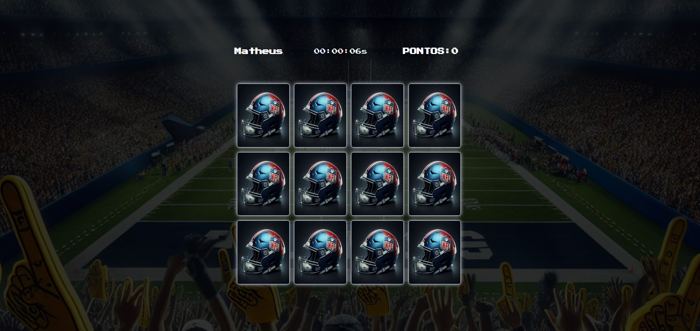
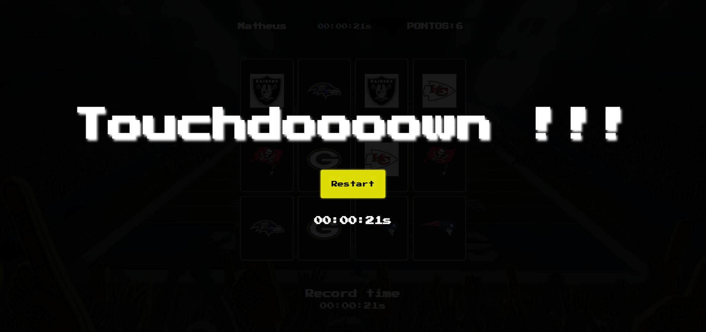
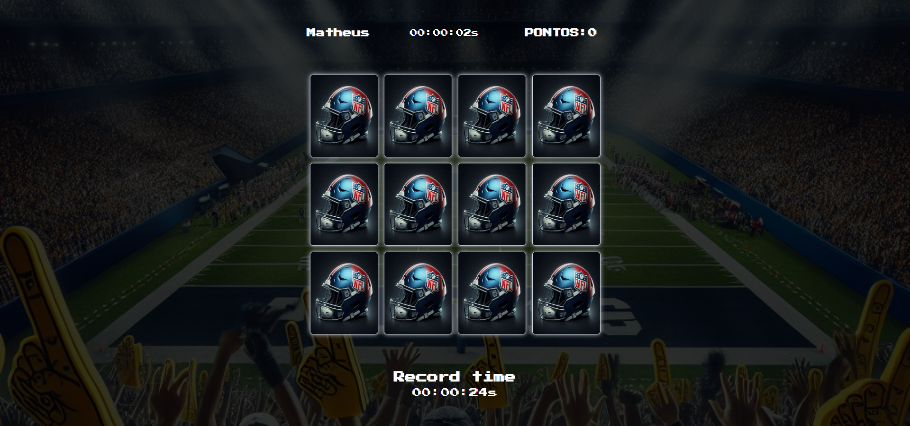

<h1 align='center'>Jogo da Memória</h1>

- [Divirta-se](https://memory-game10.vercel.app/)

## Layout
- Tela de identificação: 
- Tela do jogo: 
- Tela de restart: 

## :computer: Funcionamento 
- Temos uma primeira tela de identificação
    - Apenas para saber seu nome
- Tela do jogo:
    - Efeito de *flip-card* e **lógica do jogo**: 
        - [Sugestão de vídeo - inglês](https://youtu.be/ZniVgo8U7ek)
    - A pontuação passou a ser o tempo de resolução das combinações
        - O seu menor tempo vai ser seu recorde.
            - 

## :rocket: Tecnologias
- **JavaScript** 
- **HTML5**         
- **CSS3**     

## Bugs 
- [x] Verificar bug de atualização de recordTime
- [x] Ao entrar com um usuário limpar localStorage para o record ser 0 e depois de jogar ai sim salvar.

## Tasks
- [] Criar layouts
- [] Atualizar tecnologia
  - React | Vue 
- [] Criar salas de jogos
- [] Criar sistema para jogar juntos
- [] Criar tela para verificar sistema de pontos
